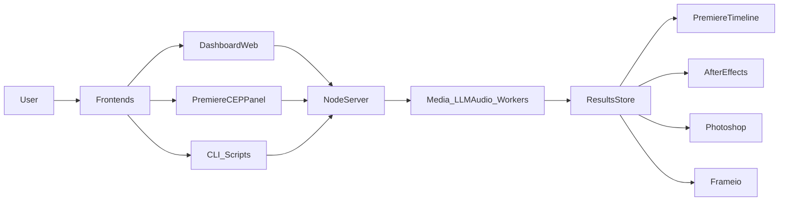

### Arquitectura de alto nivel

### Componentes principales

- **NodeServer (`server/src/index.js` + módulos)**:
  - Expone `/health`, `/v1/config*`, `/v1/jobs*`, `/v1/analyze/transcript`, `/v1/qa/analyze`, `/v1/audio/normalize`, `/v1/scene/detect`, `/v1/broll/suggest`, `/v1/reframe`, `/v1/music/analyze`, `/v1/ingest/probe`.
  - Orquesta STT, LLM, QA, scenes, b-roll, reframe y music mode usando la config unificada (`docs/data-contracts.md`).

- **DashboardWeb**:
  - `public/index.html` + `public/main.js`: dashboard vanilla.
  - `web/app/page.tsx`: dashboard Next.js.
  - Consumidor principal de `/v1/*` para:
    - Gestión de jobs (lista, detalle, run, retry).
    - Vistas específicas: Music (A3), QA (A4), B-roll (B3), Scenes (B2).
    - UI de configuración avanzada (tabs) basada en `AutokitConfig`.

- **PremiereCEPPanel (`premiere/cep-panel`)**:
  - HTML/JS (`index.html`, `js/main.js`) + ExtendScript (`jsx/host.jsx`).
  - Usa `/health`, `/v1/config*`, `/v1/jobs*`, `/v1/analyze/transcript`, `/v1/music/analyze` y aplica `markers`/`segments`/`sceneSegments` en timelines.

- **CLI_Scripts**:
  - `server/src/cli.js` para análisis desde terminal.
  - Scripts shell (`run_autokit.sh`, `run_all.sh`, `setup_whisper.sh`, `run_codex_trio.sh`, `nowiswhen.sh`, etc.).

- **ResultsStore**:
  - `server/data/jobs`, `server/data/results`, `server/data/logs`, `server/data/reframe`, `server/data/normalized`.
  - JSONs y assets descritos en `docs/data-contracts.md`.

- **Integraciones Adobe/Frame.io**:
  - AfterEffects: `after-effects/extendscript/*.jsx`.
  - Photoshop: `photoshop/extendscript/*.jsx`.
  - Frame.io: `frameio/upload.js`.

### Rutas y responsabilidades por módulo (resumen)

- `server/src/index.js`:
  - Bootstrap del servidor, carga de config (`loadConfig`), inicialización de job store y watchers.
  - Registro de todas las rutas `/v1/*` y estático de `public/`.

- `server/src/analyze.js`:
  - Implementa el contrato `JobResult` (chapters, segments, highlights, markers, summary, source).
  - Usa LLM (cuando `features.useLLM`) o heurísticos (`features.useFallbacks`).

- `server/src/qa.js`:
  - Llama a ffmpeg para generar `QaReport` (silence, black, loudness, timeStats, spectralStats).
  - Expone helpers `qaToCsv` y `qaToMarkers`.

- `server/src/scene.js`:
  - Detecta tiempos de cambio de escena y puede generar `sceneSegments`.

- `server/src/broll.js`:
  - Sugiere B-roll desde `paths.absBrollDir` según texto.

- `server/src/reframe.js`:
  - Genera versiones reframadas de un clip según ratios configurados.

- `server/src/music.js`:
  - Implementa Music Mode completo (QA + waveform/spectrogram + markers de beat/sections/drops).

- `server/src/config.js`:
  - Define `AutokitConfig`, merge default/local/perfil, resuelve paths absolutos y overrides de entorno.

### Componentes aislados y decisión

- Helpers internos en módulos (`runFfmpeg`, parsing de stderr, etc.) se mantienen encapsulados, usados solo por los endpoints públicos.
- Scripts de ejemplo se agrupan en `examples/` y se referencian desde la doc de producto en lugar de quedar “fantasmas”.

